# PuppyPi Voice Control System

A production-grade Node.js backend and Web App for controlling the Hiwonder PuppyPi robot using natural language voice commands. 

This system completely replaces the need for custom Python ROS nodes natively on the Raspberry Pi. Instead, it acts exactly like the official WonderPi mobile app by securely connecting over WebSocket to the robot's pre-existing `rosbridge_server` and communicating directly with the robot's motion controllers.

---

## 🏗️ System Architecture

The architecture consists of three core layers:

1. **Frontend UI (Web Speech API)**
2. **Node.js HTTP & WebSocket Server**
3. **PuppyPi ROS Core (`rosbridge`)**

```mermaid
sequenceDiagram
    participant User
    participant Browser
    participant Node.js Backend
    participant Raspberry Pi (ROS)

    User->>Browser: "Can you stand up?" (Voice)
    Browser->>Browser: Web Speech API transcribes
    Browser->>Node.js Backend: POST /command {"command": "Can you stand up?"}
    
    rect rgb(30, 41, 59)
    Note over Node.js Backend: Normalizer
    Node.js Backend->>Node.js Backend: Maps "stand up" → "stand"
    end
    
    Node.js Backend->>Raspberry Pi (ROS): WebSocket (roslibjs) -> pub /puppy_control/pose
    Raspberry Pi (ROS)-->>Node.js Backend: ACK
    Node.js Backend-->>Browser: 200 OK {"status": "ok", "normalized": "stand"}
    Browser-->>User: Visual Success Toast
```



---

## ⚙️ Component Breakdown (`src/` Directory)

The backend code is modularized into cleanly separated domains inside the `src` folder:

### `src/server.js` (The Entry Point)
- **Role:** The main executable script that ties everything together.
- **Functionality:** 
  - Initializes the Express.js HTTP server.
  - Serves the frontend Web UI (`public/`).
  - Boots up the WebSocket ROS Router.
  - Ensures a controlled boot sequence (waits for ROS connection before calling initialization commands on the robot).

### `src/routes.js` (The API Endpoints)
- **Role:** Handles incoming HTTP REST requests from the browser.
- **Functionality:**
  - `POST /command`: Receives raw voice strings, passes them to the Normalizer, and if a canonical match is found, passes it to the Robot controller.
  - `GET /health`: Used by the Web UI to constantly poll and verify that the backend is alive and connected to the robot.
  - Provides strict parameter validation and error formatting (200 OK vs 400 Bad Request).

### `src/ros.js` (The WebSocket Bridge Router)
- **Role:** Manages the low-level network connection to the Pi.
- **Functionality:**
  - Connects to `ws://10.152.0.201:9090` using the `roslibjs` library.
  - Contains fault-tolerant lifecycle management (if the Wi-Fi drops, it automatically loops a reconnect attempt every 3 seconds without crashing the server).

### `src/normalizer.js` (The Language Engine)
- **Role:** Voice transcripts are rarely perfect. A user might say *"go forward"* or *"can you walk forward please"*. The normalizer decipher this without needing an expensive NLP cloud service.
- **Functionality:**
  - Implements a lightning-fast **4-Phase Engine**:
    1. **Exact match:** e.g., "stand"
    2. **Starts-with match:** Prefers "go forward" over "go"
    3. **First-word fallback:** Captures the root verb if the rest of the sentence is fluff.
    4. **Whole-word regex:** Traps string targets hiding inside complex sentences.

### `src/robot.js` (The Core Motion Controller)
- **Role:** This module is the core innovation of the app. It bypasses the need for arbitrary custom Python listener scripts running on the Raspberry Pi.
- **Functionality:**
  - Maps words to exact robot physics constraints (e.g. `doMove(10, 0, 0, 2000)` sets XY velocity for exactly 2 seconds).
  - Directly commands the Raspberry Pi by publishing to `/puppy_control/pose`, `/puppy_control/gait`, and `/puppy_control/velocity`.
  - For complex, pre-encoded physical movements (like `push_ups` or `dance`), the server directly pings the robot's action group service with binary file targets (e.g., `push_up.d6ac`).

---

## 🛠️ Extensibility

To add a new action (e.g. "Sit Down"):

1. **Add to `robot.js` Action Handlers:**
   ```javascript
   async function doSit() {
     pubVel(0, 0, 0);                 // 1. Stop Movement
     await sleep(200);                // 2. Wait for momentum halt
     pubPose({ height: -6, run_time: 600 }); // 3. Drop Z-axis height
   }
   ```
2. **Map it in `DISPATCH` (`robot.js`):**
   ```javascript
   sit: doSit,
   ```
3. **Add aliases to `normalizer.js`:**
   ```javascript
   sit: ["sit", "sit down"],
   ```
4. **Add a UI chip (`public/index.html`):**
   ```html
   <span class="chip">"Sit down"</span>
   ```

## 🚀 Running the App

```bash
# Install dependencies
npm install

# Run backend on port 3000
npm start
```

## 📝 Sample Execution Log

When running the application, you'll see real-time logging as voice commands are transcribed, normalized, and executed on the robot:

```text
(base) adityanarayanverma@Aditya-Narayan-Verma-B995s-Macbook-Air ~ % cd ~/Desktop/puppipi/ros1_ws/voicecontrolapp && npm start

> puppypi-voice-backend@1.0.0 start
> node src/server.js

═══════════════════════════════════════════════════
  🐾  PuppyPi Voice Control Backend
  📡  Direct rosbridge control (no robot-side nodes needed)
═══════════════════════════════════════════════════
ROSLib uses utf8 encoding by default. It would be more efficient to use ascii (if possible).
[HTTP] ✅ Server on http://localhost:3000
[HTTP] Try: curl -X POST http://localhost:3000/command -H "Content-Type: application/json" -d '{"command":"stand"}'
═══════════════════════════════════════════════════
[ROS] ✅ Connected to ws://10.152.0.201:9090
[ROBOT] Publishers ready: /pose, /gait, /velocity
[ROBOT] Initializing robot (go_home + set_running)...
[ROBOT] ✅ go_home done
[ROBOT] ✅ set_running(true) done
[ROBOT] ✅ Robot initialized and ready.
[HTTP] POST /command
[API] Received: "turn right"
[API] Normalized: "turn right" → "right"
[ROBOT] ➡️  Executing: right
[HTTP] POST /command
[API] Received: "shutdown"
[API] ❌ Unknown command: "shutdown"
[HTTP] POST /command
[API] Received: "sit down"
[API] Normalized: "sit down" → "sit"
[ROBOT] ➡️  Executing: sit
[HTTP] POST /command
[API] Received: "jump jump"
[API] Normalized: "jump jump" → "jump"
[ROBOT] ➡️  Executing: jump
[HTTP] POST /command
[API] Received: "crawl"
[API] Normalized: "crawl" → "crawl"
[ROBOT] ➡️  Executing: crawl
[ROBOT] Initializing robot (go_home + set_running)...
[ROBOT] ✅ go_home done
[ROBOT] ✅ set_running(true) done
[ROBOT] ✅ Robot initialized and ready.
[HTTP] POST /command
[API] Received: "push up"
[API] Normalized: "push up" → "push_ups"
[ROBOT] ➡️  Executing: push_ups
[ROBOT] Initializing robot (go_home + set_running)...
[ROBOT] ✅ go_home done
[ROBOT] ✅ set_running(true) done
[ROBOT] ✅ Robot initialized and ready.
[ROBOT] Calling ActionGroup push_up.d6ac
```
