# PuppyPi Voice Control System

A production-grade Node.js backend and Web App for controlling the Hiwonder PuppyPi robot using natural language voice commands. 

This system completely replaces the need for custom Python ROS nodes natively on the Raspberry Pi. Instead, it acts exactly like the official WonderPi mobile app by securely connecting over WebSocket to the robot's pre-existing `rosbridge_server` and communicating directly with the robot's motion controllers.

---

## 🏗️ System Architecture

The architecture consists of three core layers:

1. **Frontend UI (Web Speech API)**
2. **Node.js HTTP & WebSocket Server**
3. **PuppyPi ROS Core (`rosbridge`)**

```mermaid
sequenceDiagram
    participant User
    participant Browser
    participant Node.js Backend
    participant Raspberry Pi (ROS)

    User->>Browser: "Can you stand up?" (Voice)
    Browser->>Browser: Web Speech API transcribes
    Browser->>Node.js Backend: POST /command {"command": "Can you stand up?"}
    
    rect rgb(30, 41, 59)
    Note over Node.js Backend: Normalizer
    Node.js Backend->>Node.js Backend: Maps "stand up" → "stand"
    end
    
    Node.js Backend->>Raspberry Pi (ROS): WebSocket (roslibjs) -> pub /puppy_control/pose
    Raspberry Pi (ROS)-->>Node.js Backend: ACK
    Node.js Backend-->>Browser: 200 OK {"status": "ok", "normalized": "stand"}
    Browser-->>User: Visual Success Toast
```



---

## ⚙️ Component Breakdown

### 1. Browser Client (`public/app.js` & `index.html`)
The frontend is built using standard HTML/CSS/JS with a glassmorphism UI.
- **Web Speech API:** Leverages the browser's native speech recognition engine (requires Chrome/Safari). This ensures high-accuracy speech-to-text processing on the client without requiring API keys or costly cloud STT services like Google Cloud or AWS.
- **State Management:** Tracks whether the microphone is active and polls the backend `/health` endpoint every 3 seconds to keep a visual indicator (Green/Red dot) showing ROS WebSocket connectivity.

### 2. The Normalization Engine (`src/normalizer.js`)
Voice transcripts are rarely perfect. A user might say *"go forward"* or *"can you walk forward please"*. The standard backend cannot decipher this without NLP.
The application implements a lightning-fast **4-Phase Substring Normalizer**:
1. **Exact match:** e.g., "stand"
2. **Starts-with match (longest preferred):** Prefers "go forward" over "go"
3. **First-word fallback:** Captures the root verb if the rest of the sentence is fluff.
4. **Whole-word regex:** Gracefully traps targets inside complex sentences.

### 3. Direct Robot Controller (`src/robot.js`)
This module is the core innovation of the app. It bypasses the need for arbitrary custom Python listener scripts on the Pi.
How it mimics the WonderPi app:
- **Initialization Workflow:** The Pi's motion controller engine naturally hangs on boot preventing arbitrary movements. `initRobot()` uses `roslibjs` to call standard ROS services (`/puppy_control/go_home` -> `set_running(True)`) exactly as the mobile app does when a user opens the "Performance" action tab.
- **Motion Dispatch:** Rather than sending abstract string commands to a proxy node, `robot.js` unpacks exact robot telemetry constraints (e.g. `doMove(10, 0, 0)` builds exact ROS Message configurations) and publishes them directly to `/puppy_control/pose`, `/puppy_control/gait`, and `/puppy_control/velocity`.
- **Action Groups:** For highly complex encoded movements (like `push_up`), the server directly pings the robot's `/puppy_control/runActionGroup` service with the `push_up.d6ac` binary.

### 4. ROS Bridge Router (`src/ros.js`)
Handles fault-tolerant WebSocket connections to `ws://10.152.0.201:9090` (`rosbridge_server`). Auto-reconnects safely if the Pi loses Wi-Fi or reboots.

---

## 🛠️ Extensibility

To add a new action (e.g. "Sit Down"):

1. **Add to `robot.js` Action Handlers:**
   ```javascript
   async function doSit() {
     pubVel(0, 0, 0);                 // 1. Stop Movement
     await sleep(200);                // 2. Wait for momentum halt
     pubPose({ height: -6, run_time: 600 }); // 3. Drop Z-axis height
   }
   ```
2. **Map it in `DISPATCH` (`robot.js`):**
   ```javascript
   sit: doSit,
   ```
3. **Add aliases to `normalizer.js`:**
   ```javascript
   sit: ["sit", "sit down"],
   ```
4. **Add a UI chip (`public/index.html`):**
   ```html
   <span class="chip">"Sit down"</span>
   ```

## 🚀 Running the App

```bash
# Install dependencies
npm install

# Run backend on port 3000
npm start
```

## 📝 Sample Execution Log

When running the application, you'll see real-time logging as voice commands are transcribed, normalized, and executed on the robot:

```text
(base) adityanarayanverma@Aditya-Narayan-Verma-B995s-Macbook-Air ~ % cd ~/Desktop/puppipi/ros1_ws/voicecontrolapp && npm start

> puppypi-voice-backend@1.0.0 start
> node src/server.js

═══════════════════════════════════════════════════
  🐾  PuppyPi Voice Control Backend
  📡  Direct rosbridge control (no robot-side nodes needed)
═══════════════════════════════════════════════════
ROSLib uses utf8 encoding by default. It would be more efficient to use ascii (if possible).
[HTTP] ✅ Server on http://localhost:3000
[HTTP] Try: curl -X POST http://localhost:3000/command -H "Content-Type: application/json" -d '{"command":"stand"}'
═══════════════════════════════════════════════════
[ROS] ✅ Connected to ws://10.152.0.201:9090
[ROBOT] Publishers ready: /pose, /gait, /velocity
[ROBOT] Initializing robot (go_home + set_running)...
[ROBOT] ✅ go_home done
[ROBOT] ✅ set_running(true) done
[ROBOT] ✅ Robot initialized and ready.
[HTTP] POST /command
[API] Received: "turn right"
[API] Normalized: "turn right" → "right"
[ROBOT] ➡️  Executing: right
[HTTP] POST /command
[API] Received: "shutdown"
[API] ❌ Unknown command: "shutdown"
[HTTP] POST /command
[API] Received: "sit down"
[API] Normalized: "sit down" → "sit"
[ROBOT] ➡️  Executing: sit
[HTTP] POST /command
[API] Received: "jump jump"
[API] Normalized: "jump jump" → "jump"
[ROBOT] ➡️  Executing: jump
[HTTP] POST /command
[API] Received: "crawl"
[API] Normalized: "crawl" → "crawl"
[ROBOT] ➡️  Executing: crawl
[ROBOT] Initializing robot (go_home + set_running)...
[ROBOT] ✅ go_home done
[ROBOT] ✅ set_running(true) done
[ROBOT] ✅ Robot initialized and ready.
[HTTP] POST /command
[API] Received: "push up"
[API] Normalized: "push up" → "push_ups"
[ROBOT] ➡️  Executing: push_ups
[ROBOT] Initializing robot (go_home + set_running)...
[ROBOT] ✅ go_home done
[ROBOT] ✅ set_running(true) done
[ROBOT] ✅ Robot initialized and ready.
[ROBOT] Calling ActionGroup push_up.d6ac
```
